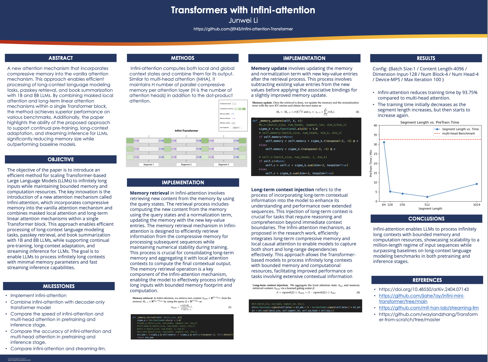
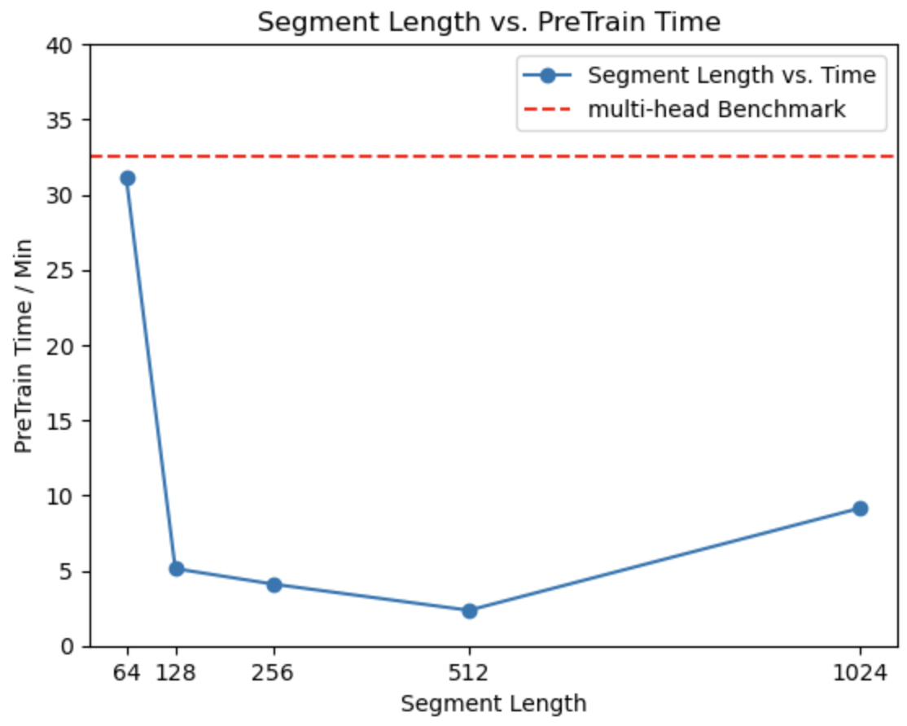

# Transformers with Infini-attention

This implementation is based on a close-source paper from Google titled "Transformers with Infini-attention." The paper can be found [here](https://doi.org/10.48550/arXiv.2404.07143). 

I have implemented the Infini-attention mechanism and compared it with the traditional multi-head attention. The Infini-attention mechanism saves 93% of the time in the pretrain stage while maintaining the same level of accuracy.

## Poster


## How to Run
To run the implementation, follow these steps:

1. Clone the repository:
   ```bash
   git clone https://github.com/your-username/your-repository.git
   cd your-repository

2. Train
    ```bash
    train.ipynb
    ```

## Key Implements:
1. Memory retrieval
Infini-attention involves retrieving new content from the memory by using the query states. The retrieval process includes computing the new content from the memory using the query states and a normalization term, updating the memory with the new key-value entries.
    ```python
    def _memory_retrival(self, batch_size, q):
        sigma_q = (nn.functional.elu(q) + 1.0)
        #sigma_q:[batch_size, num_heads, segment_len, dim_k]
        #self.memory:[batch_size, num_heads, dim_k, dim_v]
        #self.z:[batch_size, num_heads, 1, dim_k]
        #att_mem:[batch_size, num_heads, segment_len, dim_v]
        att_mem = ((sigma_q @ self.memory) / (sigma_q @ self.z.transpose(-2, -1))).detach()
        return att_mem
2. Memory update
This process involves subtracting existing value entries from the new values before applying the associative bindings for a slightly improved memory update.
    ```python
    def _memory_update(self, k, v):
        #k,v:[batch_size, num_heads, segment_len, dim_k/dim_v]
        sigma_k = nn.functional.elu(k) + 1.0
        # self.memory:[batch_size, num_heads, dim_k, dim_v]
        if self.memory!=None:
            self.memory = self.memory + sigma_k.transpose(-2, -1) @ v
        else:
            self.memory = sigma_k.transpose(-2, -1) @ v
        
        # self.z:[batch_size, num_heads, 1, dim_k]
        if self.z!=None:
            self.z = self.z + sigma_k.sum(dim=-2, keepdim=True)
        else:
            self.z = sigma_k.sum(dim=-2, keepdim=True)
    ```

3. Long-term context injection
This injection of long-term context is crucial for tasks that require reasoning and comprehension beyond immediate context boundaries. The Infini-attention mechanism, as proposed in the research work, efficiently integrates long-term compressive memory and local causal attention to enable models to capture both short and long-range dependencies effectively.
    ```python
    att=nn.functional.sigmoid(self.betas) * att_mem + (1 - nn.functional.sigmoid(self.betas)) * att_dot
    att = att.view((batch_size, self.segment_len, self.num_heads * self.dim_v))
    ```

## Result:
- Infini-attention reduces training time by 93.75% compared to multi-head attention.
- The training time initially decreases as the segment length increases, but then starts to increase again.
<div style="text-align:center">
  
</div>

